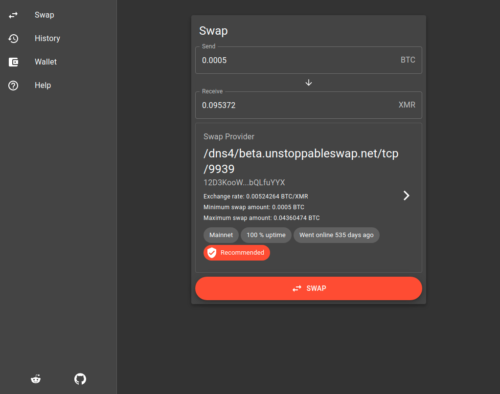
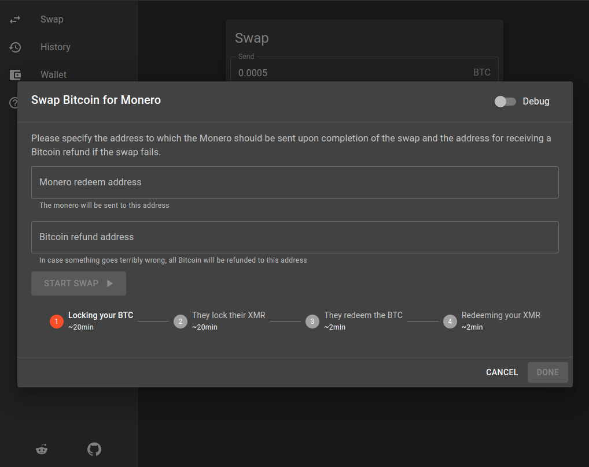

# BTC --> XMR Atomic Swap Guide  
  
This is a guide using Comit-network's [unstoppableswap-gui](https://github.com/UnstoppableSwap/unstoppableswap-gui/releases).    
    
Swaps currently only work one direction as of June 2023, Bitcoin --> Monero. There is no atomic swap for the other direction, XMR --> BTC. This is due to a technical constraint from the Monero side. There is ongoing research into this topic.

- Download the [unstoppableswap-gui](https://github.com/UnstoppableSwap/unstoppableswap-gui/releases) release for your system. 

- After downloading the latest release, the user will be greeted with the swap menu.

- Choose swap provider.
    - Parameters to consider when choosing a swap provider:
        - Network (Mainnet or Testnet)
        - Uptime
        - History
        - Exchange rate
        - Maximum/minimum swap amount
- After choosing swap provider and inputting the amount of Bitcoin to swap, select **SWAP**.  

- Input which XMR address to receive funds to.
- Input a BTC address to receive a refund to (this refund is only there if something goes wrong during the trade, all bitcoin will be returned to the BTC address).
- Select **Start Swap**.
- The unstoppableswap-gui client will communicate the fee with the market maker, then the user will receive a Bitcoin deposit address. Send Bitcoin to this deposit address. 
    - The user is given a range that the market maker will accept, and it is possible to send any amount between this range.
    - The BTC transaction need to reach 2 confirmations, after which the market maker then locks up the Monero.
    - The Monero is locked up for 10 confirmations. Then the market maker has the BTC deposited to their address.
    - After the market maker funds are deposited, the XMR is deposited in the wallet address which was provided before.
- After the designated amount of confirmations, the XMR is available in the user wallet!  

### Enhanced privacy and tips:   

- In the *Help* menu, enable tor by selecting *START TOR*.
- Use own Electrum Server or a trusted party's server.
- Use coin control when using bitcoin, and always use an address thats never been used for the *Bitcoin refund address*.  
- Find swap providers here:
    - [https://xmrswap.me/#providers](https://xmrswap.me/#providers) 
    - [https://unstoppableswap.net/](https://unstoppableswap.net/)

