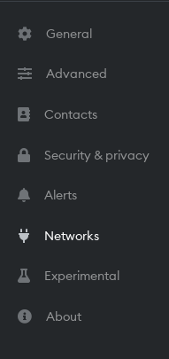
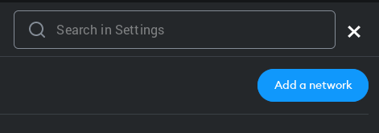
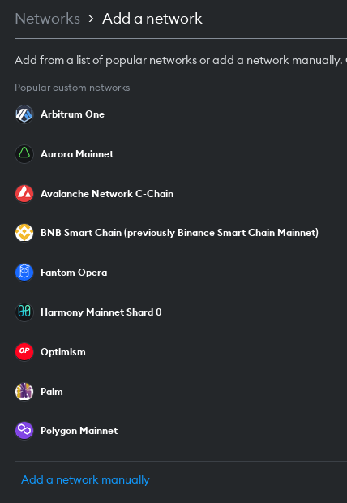
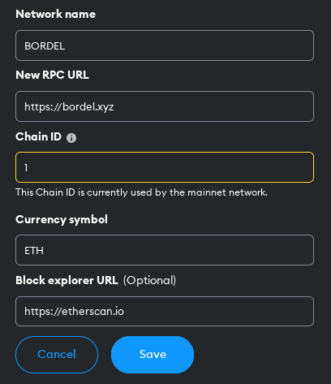

# Changing RPC guide

## In Metamask

**1) Go to Networks**

- Go to 'Networks' in Metamask to change RPC.

**2) Add a network**

- Click on the button 'Add a network'

**3) Add a network manually**

- Select 'Add a network manually'

**4) Add information for Custom RPC**

The custom RPC is mostly using the same information as Etherum mainnet. What we change is the *Network name* which can be any name and is visible to the user on their own account 
and *New RPC URL*. In *New RPC URL* we write the TRUSTED new endpoint. Because we want to change the RPC for Etherum; *Chain ID*, *Currency symbol* and *Block explorer URL* remain 
the same. Paralelní Polis is offering the community to use their endpoint https://bordel.xyz.

