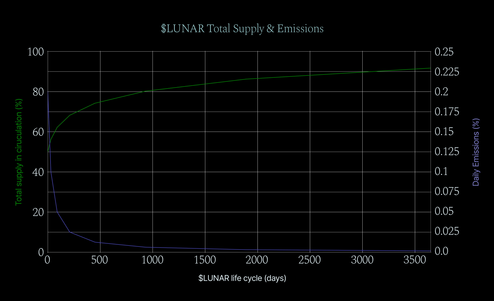

# $LUNAR Life Cycle

*NOTE: Please read [Current state](./update.md) before continuing reading **Tokenomics.***

**Unlock Schedule**

Since the Genesis Event, the LunarDAO Life Cycle starts. $LUNAR has a maximal supply. 50% $LUNAR remains locked and will be released, from Day 0. The release schedule starts sharp to bring more liquidity, and gets flatter over time through halving periods.

* Emissions will be halved and every halving period will always double from the last one. Such mechanism ensures more liquidity in the early stage and higher staking incentives through locking period. Rather quickly a decline of emissions comes into play which prevents diluting of value. First emission halving takes place already after 30 days, next after another 60 (30 * 2) as every halving period doubles. This will continue until the supply is nearly flat.

*Table 2: Supply Schedule in First 10 Years of $LUNAR Life Cycle*

|   **Halving Event**   |   **Days of Lifecycle** |   **Circulating Supply (%)** |   **Daily Emission (%)** |
| ------------------- | --------------------- | ------------------------ | -------------------- |
|                 0 |                   0 |                   50   |         0.2        |
|                 1 |                  30 |                   56.2 |         0.1        |
|                 2 |                  90 |                   62.2 |         0.05       |
|                 3 |                 210 |                   68.2 |         0.025      |
|                 4 |                 450 |                   74.2 |         0.0125     |
|                 5 |                 930 |                   80.2 |         0.00625    |
|                 6 |                1890 |                   86.2 |         0.003125   |
|                 7 |                3810 |                   92.2 |         0.0015625  |
|                 8 |                7650 |                   98.2 |         0.00078125 |

Emission happens daily - starting at 0.20% a day. Emitted $LUNAR tokens will be allocated:
 
*Table 3: $LUNAR emitted token distribution*

| **Subject** | **Emitted $LUNAR %** |
| --- | ---: |
| Staking rewards | 50% |
| Liquidity mining (premium rewards to LP providers | 10% |
| Protocol Owned Liquidity pool | 8% |
| LunarDAO treasury | 10% |
| Core Team | 7% |
| Research | 4% |
| Education | 4% |
| Marketing | 4% |
| Airdrops / Giveaways | 3% |

