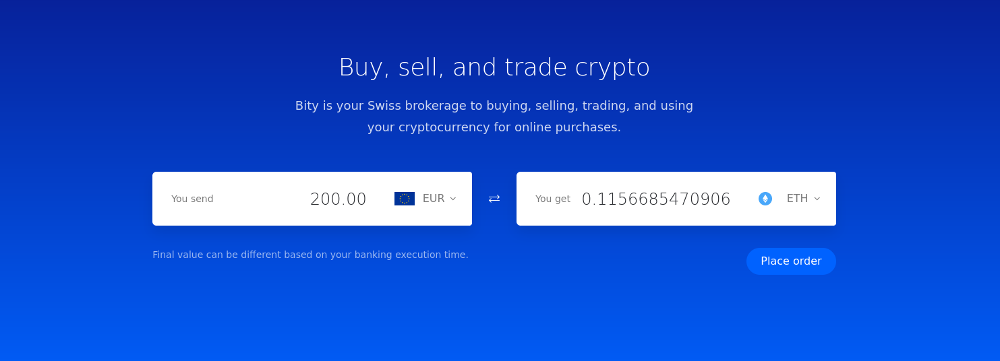
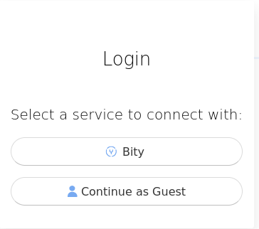
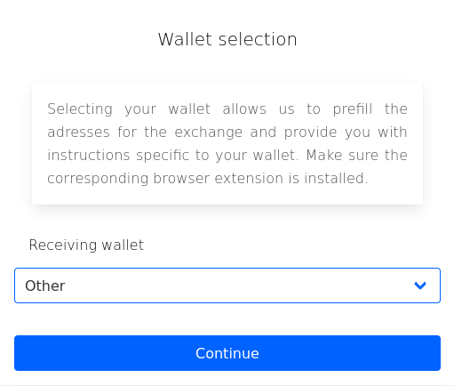
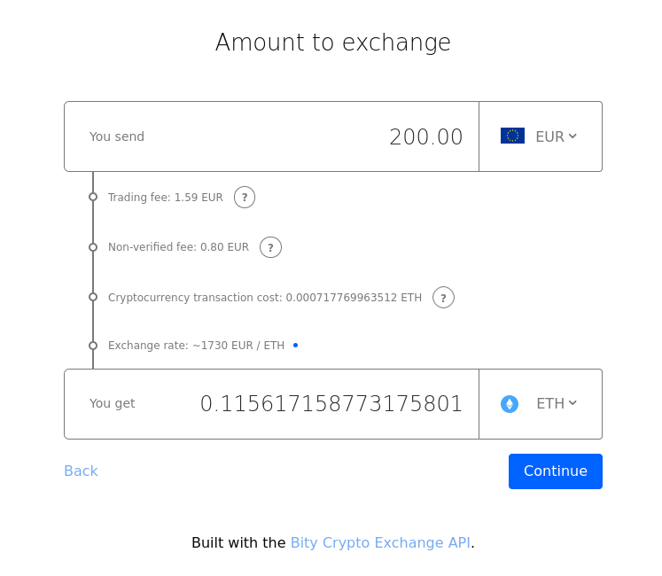
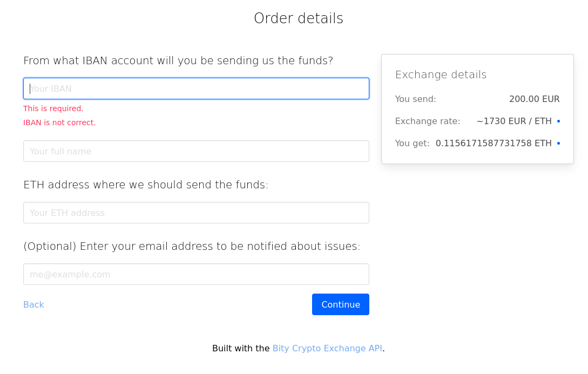

# Fiat to crypto

When using a regular os (instead of ie. tails), make sure to protect network privacy by using ie. mixnet or VPN such as [NYM](https://nymtech.net/), [HOPR](https://hoprnet.org/), [Lokinet](https://lokinet.org/), [Geph](https://geph.io/en) or [ProtonVPN](https://protonvpn.com/download).

## Set up a Metamask wallet

A Metamask wallet can be set up on virtual machine, Tails or Tor browser on regular OS (read Linux).

- Open Tor browser.  
- In the upper right corner (the burger), go to 'Add-ons and themes'.  
- Search for Metamask.  
- 'Install for firefox' (works for Tor browser as well) as browser extention. select 'Continue to installation' (this will take a minute or so), 'Add',  'Allow this extention to run in private windows'. 
The icon will be visible in the upper right corner.  
- Click on icon. It will open a new tab in Tor browser. 
- Select 'Create a new wallet', 'I agree', submit a password and 'Create a new wallet'.  
- Choose 'Secure my wallet'. This will bring you to the recovery phrase. 'Reveal Secret recovery Phrase'. 
- Write down the recovery phrase in ie. keepass or any other safe place. With the recovery phrase (even without password, it possible to access the wallet, but not vice versa especially if the 
browser doesn't store any information the recovery phrase will be continously used).
- When asked to re-enter parts of the recovery phrase make sure there are no whitespaces or it is not possible to proceed.  
- When completed and in the wallet - At the top, the wallet address is partially displayed. Copy the address to the keepass to have easy access.  
- Change RPC to not leak metadata (default ones collect a lot of user data): [https://wiki.lunardao.net/change_rpc.html](https://wiki.lunardao.net/change_rpc.html)  
- Check [Anonymizing assets](https://wiki.lunardao.net/anonymizing_assets.html) for more info on setting up an anon wallet.  

## Transfer money from your bank account (and exchange to ETH) via Bity

- Go to [Bity](https://bity.com) and enter how much in EUR to transact from the bank account to crypto wallet. Select ETH as the crypto currency.  

- Select 'Continue as guest'.

- Keep 'Other' and continue.

- Check fees and that the amount is correct. Select 'Continue'.

- Enter IBAN number for the bank account the money will be sent from.  
- Enter full name connected to the bank account.  
- Enter the wallet address of the Metamask wallet that was set up in the previous step.  
- Enter an email address to get notifications (*Note: Set up the email on tails or on tor browser while using VPN, ie. [Protonmail](https://proton.me/)*). Expect it to take one to two bank days before the money is in the Metamask wallet.

## Exchange to other currencies

After buying crypto via Bity, make sure to [Anonymize your assets](./anonymizing_assets.md).

