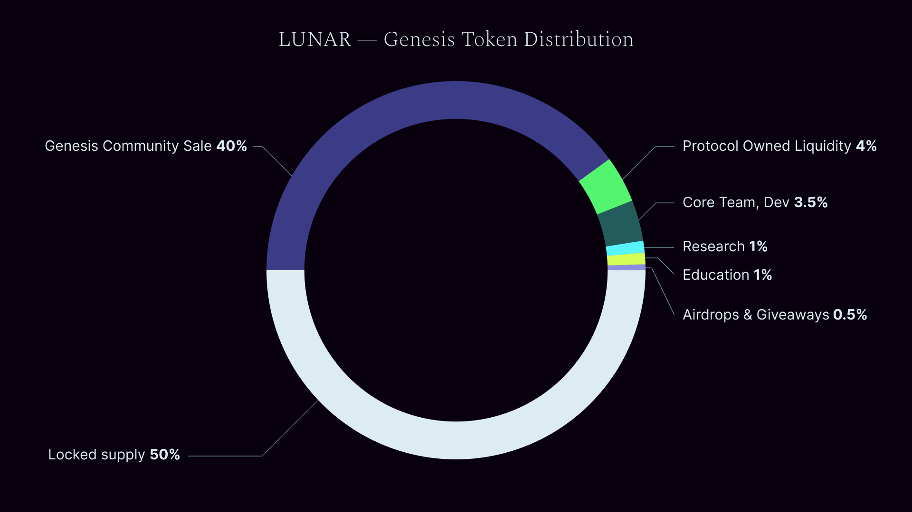

# Genesis Event - $LUNAR Initial Allocation

*NOTE: Please read [Current state](./update.md) before continuing reading **Tokenomics.***

* Genesis supply release = 50%
* Locked supply = 50%

***The Genesis Event*** - Day 0 of LunarDAO and $LUNAR life-cycle

* Genesis event is when the Genesis community sale is finished
* Initial Supply gets allocated (see Table 1)
	
*Table 1: $LUNAR allocation at Genesis Event*

| **Subject** | **Allocation of total supply** | **Allocation of genesis (circulating) supply** |
| --- | ---: | ---: |
| Genesis Community sale | 40% | 80% |
| Protocol owned liquidity | 4% | 8% |
| Core team, Dev | 3.5% | 7% |
| Research | 1% | 2% |
| Education | 1% | 2% |
| Airdrops & giveaways | 0.5% | 1% |

**Valuation of the Genesis Event**

- Circulating supply: 50% of total supply = 1,000,000,000 * 50 / 100 = 500,000,000.0 $LUNAR
- Genesis Community Sale allocation: 40% of total supply (80% of circulating supply) = 1,000,000,000 * 40 / 100 = 400,000,000 $LUNAR
- Market cap: Sum of ETH in the Genesis Community sale
- 1 $LUNAR price (same for everyone): Market cap / Circulating supply
- $LUNAR allocation per genesis community member: invested ETH / total collected ETH * $LUNAR supply in the auction pool
- LunarDAO treasury value: 100% of collected ETH in the Genesis sale event (under the control of LunarDAO Squad)

> Explanation of the Genesis Community Sale: LunarDAO founders allocate a fixed amount of $LUNAR token (40% of total suppy) to an auction. This supply gets locked in the Liquidity bootstrapping type of pool (LBP) for 5 days. Everyone who wants to be a initial LunarDAO community member invests ETH into the locked pool. In the end of the event, the price of $LUNAR is total amount of collected ETH * USD (ETH spot price) / $LUNAR circulating supply. Circulating supply at that point is 50% of maximum. Every participant will receive $LUNAR for the same price. No VC's, no presale! At this point $LUNAR is only distributed between the community, the founding core team and in a coffer for possible airdrops. The collected ETH is LunarDAO squad wealth. Every community member can stake $LUNAR and become a Squad member - decide over the treasury management, propose changes and vote to improve LunarDAO (see [Governance](./governance.md) document). 

