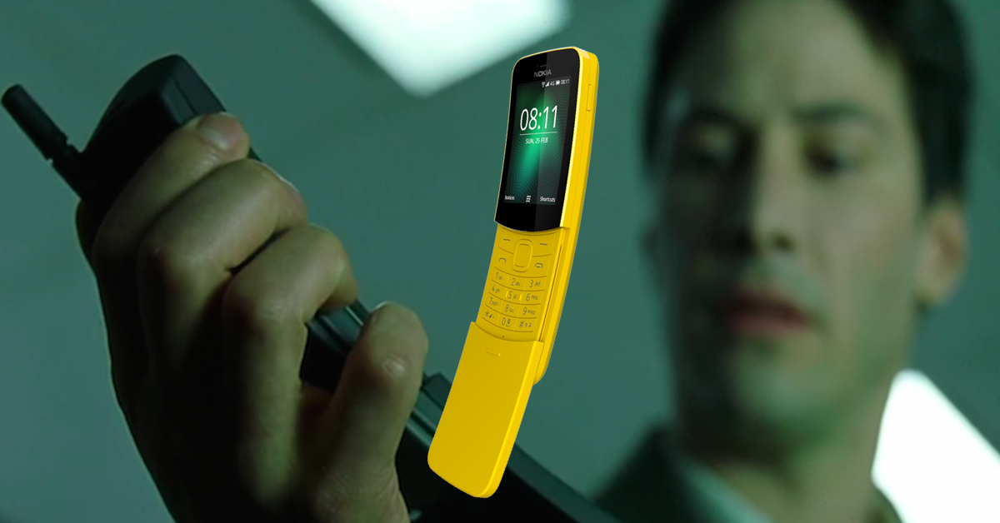

# Banana phone & Changing IMEI

**NOTE:** *Changing users IMEI number is illegal in multiple jurisdictions. This page is not to promote any activity which can cause users any legal problems! Please research the laws concerning this issue in your region. LunarDAO is not responsible for any decisions done by the users! If you are uncertain, please do not read further and leave this page.*

There are multiple security risks when using a mobile provider (phone or router + sim card) as a hotspot. One security risk is the unique sim card and all of identifying information leaked. We will cover this issue later on but there are sources to buy sims without KYC and change them as often as a user needs. Another security issue is that despite changing a simcard often, the internet or hotspot device - phone or portable router - has a unique IMEI number ([International Mobile Equipment Identity](https://en.wikipedia.org/wiki/International_Mobile_Equipment_Identity)) which stays the same despite changing MAC or IP address. This makes it easy to track.

Nokia 8110 or *Banana phone* (as it's known) is a great hotspot device, separated from the users main internet device (smart phone, tablet or laptop). With a few hacks, the *Banana phone* allows a user to change its IMEI. Such a setup has several advantages:

1. Keeps the sim away from the actual user's devices - does not leak the main internet device IMEI
2. Nokia 8110 can appear on the GSM network as any other phone since IMEI numbers are unique per device. 
3. If IMEI and simcard are changed together - the user is very hard to be traced (mind the place of connection and other active devices!)

*Note: If not changed regularly, the risk of compromise is higher. Both sim and IMEI need to be changed at the same time!*

**Hacking a Banana Phone**

The Banana phone has many different ways to be hacked for IMEI randomization. The most simple way is to install [Wallace Toolbox](https://gitlab.com/suborg/wallace-toolbox/-/archive/master/wallace-toolbox-master.zip). Here is [Banana hackers guide](https://sites.google.com/view/bananahackers/root/temporary-root) on how to install Wallace Toolbox.

Installing [**Gerda OS**](https://gerda.tech/#h1.4_install) improves usability, but is not needed to change IMEI. It's even possible to install Debian, called [Bananian](https://gitlab.com/bananian/bananian) on this phone! LunarDAO Squad plans to make comprehensive manuals on all the IMEI randomizing devices and the installation steps.

**IMEI numbers**

If you succesfully hacked a *Banana phone* or already have one, it can be pain in the ass to find correct IMEI numbers, or even worse to make one up. Thanks to our fellow hackers, there is a generated [IMEI table](imei_tables/imei_table.md) with several thousands IMEI numbers.

**DISCLAIMER:** *The table was not created by LunarDAO Squad neither fully tested. All the data are accessible online, LunarDAO only provides a more accessible format.*

