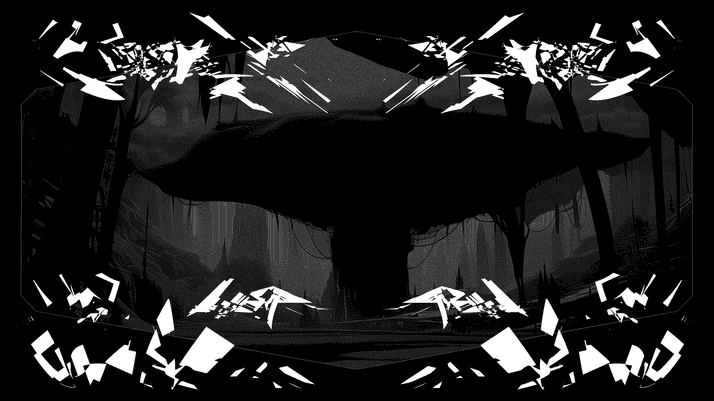

# Opt OUT!

When [Edward Snowden](https://www.whistleblowers.org/whistleblowers/edward-snowden/) was working for NSA he decided to stand against status quo and leak information about global surveillance programs, 
many which are run by the NSA in cooperation with telecommunication companies and European governments. This is the tip of the iceberg in regards to surveillance measure of governments and Big tech today. 
Edward Snowden was forced to leave US to avoid imprisonment for sharing this information to people who are the targets of this surveillance. 

[Julian Assange](https://www.freeassange.net/), who was imprisoned in UK (now released), is one of the founders of Wikileaks. He was initially charged with espionage by US (which concluded with a plea deal 
where [Assange admitted to hacking](https://www.bbc.com/news/articles/c511y42z1p7o)) for sharing the truth about US [war crimes](https://wikileaks.org/+-War-Military-+.html) in Iraq and Afghanistan. 
In regards to surveillance, Wikileaks published extensive materials on CIA projects to intercept SSH credentials, target Linux, Windows and MAC systems, utilize webcams and suspend video recordings and also 
published research about [Amazon's collaboration](https://wikileaks.org/amazon-atlas/) with the US Department of defense and CIA, and [surveillance contractors](https://wikileaks.org//spyfiles/russia/) in 
Russia to name a few. 

Google holds over 70% of the browser market and through IP addresses tracks what we do on internet. Big tech collaborate with governments by handing over information on demand. Even when we are not online, 
society is digitalized which faciliates enforcing control measures. When we move in society cameras are watching us or the electronic cards we might use for transportation or payment map out our lives. 

To develop open source software which aims to bring privacy solutions to users is being criminalized. When [Tornado cash](tornado.cash) developer [Alex pertsev](https://www.freealex.nl/) was arrested in
 Amsterdam, US government publicly tagged all Tornado cash users. The current push to regulate crypto including imposing CBDC (Central Bank Digital Currency) is a way for nation-states to co-opt crypto, 
control people and money flow.

If we want to opt out of the surveillance system, we need to build privacy tools, as well as sharing knowledge and resources on what is already existing. 
  
For further materials concerning state and corporate surveillance, see the [Surveillance section](./surveillance_intro.md) in the wiki.

