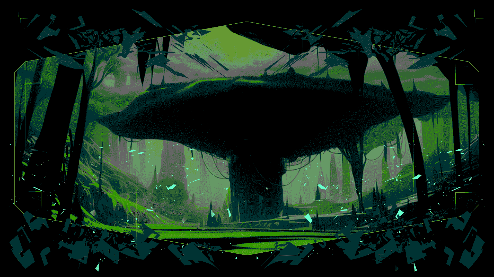

# LunarDAO Manifesto

## The Leviathan

Information is power. Privacy and transparency are two antithetical dimensions of information. Transparency must apply to those in power, to lay open their machinations and hold them accountable. This includes any government, supranational entity, corporations and conglomerates. 
Privacy is for the people, to prevent the agents of power from intruding in the innermost parts of our individual and social existence.

The mouthpieces of the surveillance state claim that our sanctuaries and agoras are enabling criminals to sell drugs, weapons and human beings, and laundering money through cryptocurrencies. They use this as an excuse to block our access to DeFi and privacy tools and limit our autonomy. All the while the crimes we stand accused of are carried out day by day on a massive scale by well-connected and legally protected people, aided by national governments, their courts and law enforcement bodies. While attacking tools that empower people, they commandeer the black market and launder money through esteemed international banks.

So-called democratic nation-states openly make profit by entertaining economic relations with regimes they pretend to reject. Especially when it comes to war industry, these profitable relations are carried out against international conventions these states promoted themselves. Armaments are sold to regimes and used against civilians and liberation movements in the name of profit.

Hegemonic nation-states and their financial institutions have control over our lives. As long as we depend on their money we have no choice but to live under the dominion of empires. Banks track and control the money flow and can freeze assets at any time. They tempt us with the illusion of wealth, making us believe that we are part of the big game, when really we are expropriated. We are the yield.

## Sunset

Decades ago, cypherpunks foresaw the rise of censorship and surveillance. They understood that cryptography and economic sovereignity were necessary to ensure freedom. Bitcoin created an economy outside of financial hegemony and made it possible for people to regain agency. 

Today that is no longer enough.

Crypto’s resistance to capture makes it a target. And so the surveillance state is on the attack. It has already started to make our software illegal. We are forced to self-regulate to survive. Anyone who falls into this trap has already lost.

Over the years, the voices upholding the cypherpunk mission have become fewer and quieter, drowned out by a flood of easy money. The advocates of crypto's liberatory mission lack unity as well as strategy.

LunarDAO provides such a strategy.

## Midnight

There are no institutions in this world that safeguard freedom. Those that try to are being denounced as criminal and terrorist, co-opted, marginalized and violently crushed. The existing establishment only maintains and intensifies our enslavement. We, the people, must create new worlds to live a free life. Many others before us have attempted to do so, and important contributions have been given by freedom fighters. We walk on this path remembering and celebrating this heritage and forging alliances with others struggling for liberation. We recognize the contribution done by the team of Wikileaks, which has stripped the American government of its historical immunity and shed light on the dark affairs of world powers. The United States, eager to deny the right to privacy of their citizens, are now persecuting Julian Assange for unmasking their own crimes. 

While trying to regulate their internal markets and imposing strict surveillance over the economic activities of their own citizens, countries like France have developed unregulated markets in former colonies that are crippling local economy. An exemplary case is the French sabotage in Guinea; after the former colony declared its independence, France, led by De Gaulle, counterfeited the new Guinean Franc in order to trigger an economic crisis and cast down the elected leader Touré, as testified by former French secret services agent Maurice Robert. The colonizers didn’t succeed with getting rid of Touré, but managed to damage the Guinean economy enough to ensure dependency on France. Guinean case is particularly symbolic for French policies in the former colonies of West Africa, where economics has been weaponized against local people to keep them enslaved.

This and others crimes are daily committed with impunity by authorities that persecute, torture and imprison people building concrete alternatives of free life.

This is the case of Ross Ulbricht, among others. Creator of Silk Road, an anonymous e-commerce website, Ulbricht has been sentenced to an unjustifiable two life sentences and more, without parole, because some users used the marketplace to sell and buy illegal goods, mostly cannabis. The fact that one of the drug sellers has been condemned to five years makes if crystal clear that Ulbricht has been turned into the scapegoat of the United States’ war against privacy, to spread terror and deter the online community from searching for alternatives to surveillance.

Economy is being weaponized in Iran against women struggling for their freedom, as Iranian government is threatening to freeze the bank accounts of those who refuse to adhere to the law imposing hijab.  As economic warfare is a common practice of the nation-states to impose their domain, building tools and platforms to guarantee economic freedom is a crucial struggle. 

Organization is the key to self-defense, and self-defense is necessary to live. So believed J-Stark, 3D printing pioneer, who lived by the slogan ‘live free or fucking die’. He did die for freedom – he was murdered by German police, guilty of giving people a 3D technology that deprived the state of its monopoly on weapon production. We celebrate his legacy, and recognize a society’s right to self-defense against exploitation and occupation. 

Since the dawn of the oppression of the state, free societies have armed themselves and resisted. Countless have died to protect the free life of humanity, and great victories have been achieved. But we slowly lost ground. State civilization has imposed its own narrative, casting  the memory of democratic resistance in the shadows of the past - but our legacy has never disappeared. Although at constant risk of being erased and forgotten, it still continues in the resistance against occupation, fascism, patriarchy and ecocide. It has flourished over the millennia in the uprisings of peasants against landlords, in the knowledge of the witches, in  the nomadic tribes refusing the institutions of power. The spirit of freedom that inflamed Tiananmen Square and the people of Falluja is a source of hope in Jenin and Kobane. The great battles of the past are the urban guerrilla of today. Everywhere, David is striking back at Goliath. 

Ruling elites have robbed society of its knowledge, its memories and its dimensions. They have monopolized economy, depriving it of its original meaning, rewritten history and deviated the noble purpose of science. The greed of the oppressors is pushing technology, one of the spearheads of humanity’s knowledge, into degeneration. As they weaponize technology to enforce oppression, we are committed to using our skills to promote liberation. 

This is why lunarpunks gather in the periphery rather than the center. We make our home in moonlit forests of encryption outside the reach of the state. We refuse to leave our protection in the hands of governments and Big Tech. We consider self-defense to be everyone's responsibility.

Rulers maintain authority by keeping people isolated. When we are alone, we cannot build the strength to change our realities. That is why lunarpunks are not content with the modern mirages of individual liberty.  We form squads, clans and communities and fight for collective liberation. 

## Moonrise

Freedom can only be found outside the logic of domination. Self-defense requires a philosophy rooted in liberation and adequate tools. We must bypass the all-pervasive mindset of submission and obedience. Lunarpunk forest is a sanctuary where society can redefine itself, self-administrate and regain its economic, political and moral agency. As our community grows, we witness how society can truly flourish only when free from state. But in order to protect ourselves and our communities from oppression, we need to practice self-defense. 

Decentralized, private and anonymous networks are fundamental for communities to defend themselves. Self-defense requires control over information, infrastructure and material resources. Lunarpunks use zero-knowledge cryptography to create a shield of privacy and anonymity that enables communities to operate without persecution by the state.

**The aims of LunarDAO are:**

- Enable parallel confederated societies that are diverse and autonomous but mutually protect each other against central authority.

- Learn, educate, share knowledge. Education is fundamental in our struggle for free life, autonomy, and community.

- Develop infrastructure for economy and politics beyond the state, that is uncensorable, sovereign and anonymous. Expand the dark forest.

LunarDAO invests in privacy projects and anonymity-oriented tooling for the lunarpunk society. By prioritizing technical excellence, practicality and an uncompromising philosophy of freedom it creates value building towards a self-sustaining antifragile ecosystem.  We believe that lunarpunk is not something distant. It is available to anyone who is ready to make a choice: to let nation-states control our lives or to join the fight for freedom. 

Anyone can join LunarDAO and start a new investment project or take part in an existing one. Learn how to use free software and privacy tools, extend the reach of infrastructure, exit Big Tech and the surveillance state, learn programming, study economics and build the counter-economy. 

Sunset has arrived. The moonlit night is coming.

# Moonlight, or the lunarpunk future

In the darkness of the night, the forest of encryption is alive. Many tribes have found a sanctuary under the thick branches of its trees. Societies are regaining their strength, and free life is being built under the gentle light of the moon. Outside of the forest, war is raging. Nation states are in conflict with one another, ecocide is being perpetrated against nature, and repression strikes those who struggle for freedom. The more the agents of the state attack, the more individuals and groups escape the scorching sun of surveillance and seek refuge in the moonlight of anonymity. Societies, finally aware of themselves, defend their forest through cyber-guerrilla and regain territory. 
A new moon shines on earth.

