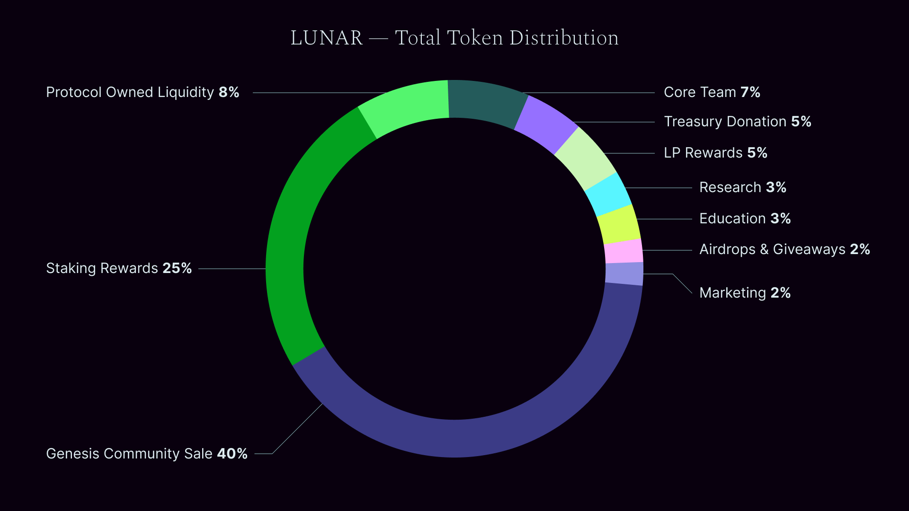

# Overall $LUNAR Distribution

Combining the initial supply allocation and the unlock supply distribution returns the total $LUNAR distribution.

*Table 4: $LUNAR total token distribution*

| **Subject** | **Distribution** |
| --- | ---: |
| Genesis Community sale | 40% |
| Staking rewards | 25% |
| Protocol owned liquidity | 8% |
| LP rewards | 5% |
| Treasury donation | 5% |
| Core Team | 7% |
| Research | 3%|
| Education | 3% |
| Airdrops & Giveaways | 2% |
| MArketing | 2% |

Most of the emitted supply is on staking and LP rewards. On top of that, staking allows for voting and locked tokens are not considered as circulating supply. This mechanisms brings an organic incentive for the community to appreciate their governance token and stabilizes the price against big dumps. Part of emissions are donation to the treasury, Liquidity for POL and moderate percentage to the core team and research to run the DAO and a coffer for airdrops and giveaways.
