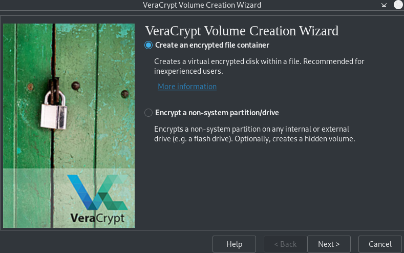
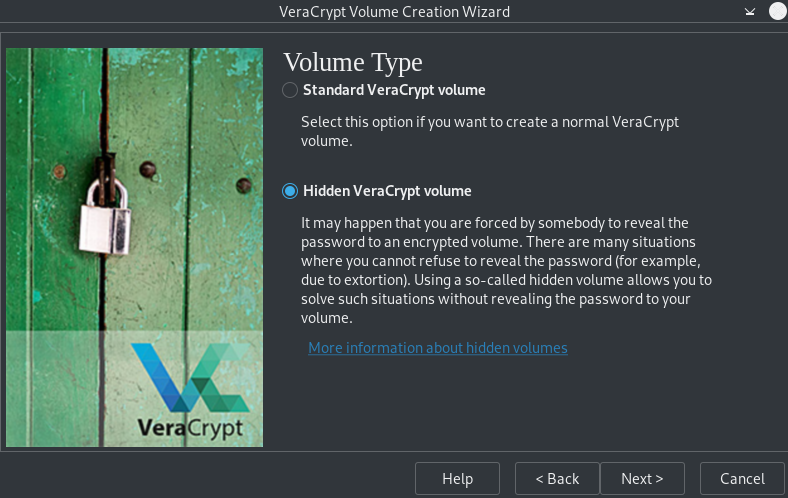
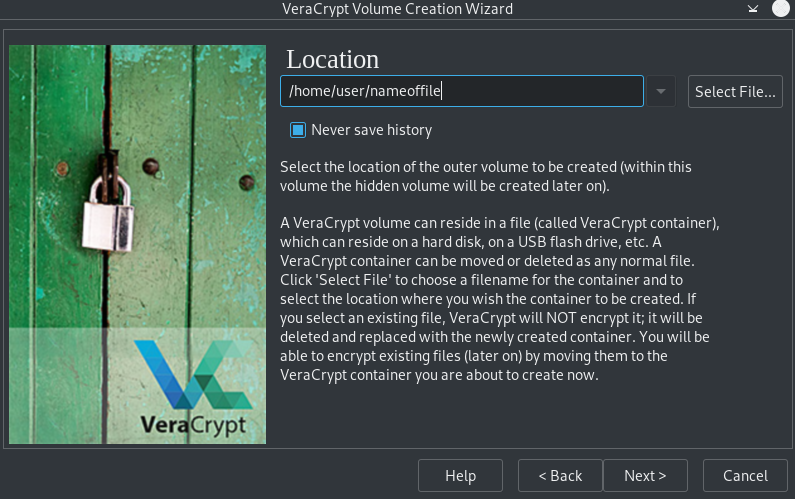
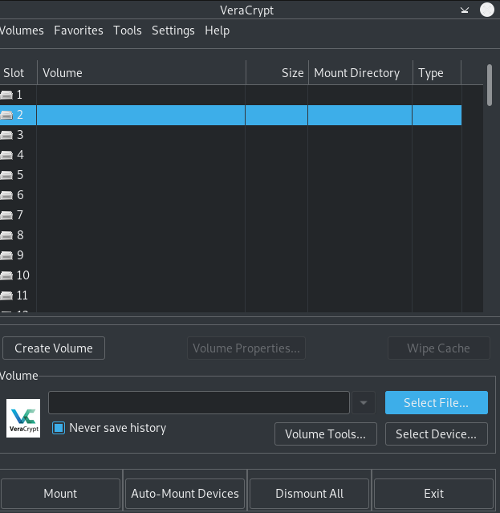

# VeraCrypt

## Download and installation

- Download [here](https://www.veracrypt.fr/en/Downloads.html).  

- Go to the download folder.

```sh
cd Downloads
```

- If .deb file, install ie. with terminal (for other, check VeraCrypt information):

```sh
sudo dpkg -i filename
```

***Note***

- Check if there are dependecies missing. This information will be shared if the installation is unsuccessful.
'libwxgtk3.0-gtk3-0v5' is a common dependency that might be missing. If so, install it like this:

```sh
sudo apt-get install libwxgtk3.0-gtk3-0v5
```

- It is also possible that there will be other proposals for action. Read the error message. 
Could for example be 'Unmet dependencies. Try 'apt --fix-broken install'.

```sh
sudo apt --fix-broken install
```

- When installed, VerCrypt appears in the menu and is a GUI.

- Open VeraCrypt and follow the [*Beginner tutorial*](https://www.veracrypt.fr/en/Beginner%27s%20Tutorial.html) to create a regular encrypted volume.

## Hidden volumes

To create a hidden volume the user first create a regular encrypted volume as a from in which they store the 'sensitive' files. 
Within this encrypted folder there is a hidden folder which is not possible to detect. It is protected with another password. Depending on which password that is submitted when mounting the volume the user will access the outer (visible) encrypted folder or the hidden one.

**Step 1**

- Select *Create an ecrypted file container*.



**Step 2**

- Choose *Hidden VeraCrypt volume*.



**Step 3**

- Write the whole path (DON'T use '~/') and add the name and file ending for the encrypted folder to create.



- After this, follow the steps in VeraCrypt [*Beginner tutorial*](https://www.veracrypt.fr/en/Beginner%27s%20Tutorial.html) **Step 8**.

- Note that after **step 11**, the encrypted folder will be opened and the user can move the 'sensitive' files there which are okey to show on request.When this is done there will be a setup of a second password which is for the hidden folder. VeraCrypt calculates how much space that can be used for the hidden folder.

- For maximum encryption strenght it is important to move the mouse (on request) for as long as possible before selecting *Format*.

**Mounting the volume**

- Select a slot.  
- Click on *Select File*.  
- Find the encrypted folder.
- Select *Mount*.  
- To open the out volume (which is okey to show on request) enter the first password.  
- To open the hidden volume instead, enter the second password.




